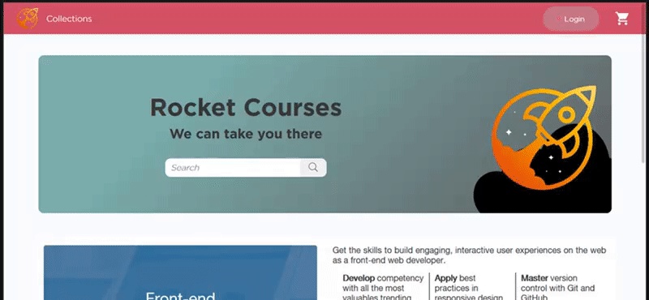

<h3 align="center">HTML Capstone Project</h3>

<div align="center">

[]()
[](https://github.com/kevinfrontend/newsweek-clone/issues)
[](https://github.com/kevinfrontend/newsweek-clone/pulls)
[](/LICENSE)
[](https://github.com/kevinfrontend)
[](https://twitter.com/kevinfrontend)

</div>

---

## 📝 Content
<p align="center">
<a href="#about">About</a>&nbsp;&nbsp;&nbsp;|&nbsp;&nbsp;&nbsp;
<a href="#installing">Installing</a>&nbsp;&nbsp;&nbsp;|&nbsp;&nbsp;&nbsp;
<a href="#built_using">Build with</a>&nbsp;&nbsp;&nbsp;|&nbsp;&nbsp;&nbsp;
<a href="#authors">Authors</a>
</p>


## 🧐 About <a name = "about"></a>
<h3 align="center"> This is an assigment for Microverse's HTML and CSS course, and the goal is to build your own personalized page, taking <a href="https://www.behance.net/gallery/24796463/ZATTIX">this</a> page as parameter.</h3>

<p align="center">
  <a href="" rel="noopener">
 </a>
</p>

---

## 🔧 Built with<a name = "built_using"></a>

- [HTML and CSS](https://www.w3schools.com/) - HTML5 and CSS3
- [Sass](https://www.sass.com/) - HTML5 and CSS3
- [Stickler](https://stickler-ci.com) - A CSS Linter 
- [W3 HTML Validator](https://validator.w3.org/) - A Markup Validation Service
- [Bootstrap 4](https://getbootstrap.com/) - The most popular HTML, CSS, and JS library in the world;
- [PhotoShop CC](https://adobe.com/) - The most powerfull photo editor ever made;

## 🔴 Live Demo

[Live Demo](https://raw.githack.com/kevinfrontend/HTML-CSS-Capstone-Project/features/index.html)

### 🛠 Installing <a name = "installing"></a>

```
- Clone or download this repository;
- Unpack (if downloaded);
- Execute index.html on your favorite browser;

```
## ✒️  Autor <a name = "author"></a>

👤 **Kevin Alves**

- Github: [@kevinfrontend](https://github.com/kevinfrontend)
- Twitter: [@kevinfrontend](https://twitter.com/kevinfrontend)
- Linkedin: [@kevinfrontend](https://www.linkedin.com/in/kevinfrontend/)

## 🤝 Contributing

Contributions, issues and feature requests are welcome!

Feel free to check the [issues page](https://github.com/kevinfrontend/newsweek-clone/issues).


## 👍 Show your support

Give a ⭐️ if you like this project!


## 📝 License

This project is free to use as learning purposes. For any external content (e.g. logo, images, ...), please contact the proper author and check their license of use.


## 📣 Note from Author to you: 

As always, I like to write some unrelated things here, to make our relationship closer, today I'd like to say a few things, remind you about the covid-19 outbreak:

```
Wash hands 🚿 ;
Avoid touching people 👋;
Stay home! Keep youself safe 🏡;
Take care of your loved ones 👪;

Wish you a Happy coding and a Happy life  ❤️
```

<small>Template made by <a href='https://twitter.com/kevinfrontend'>Kevin Alves</a></small>
